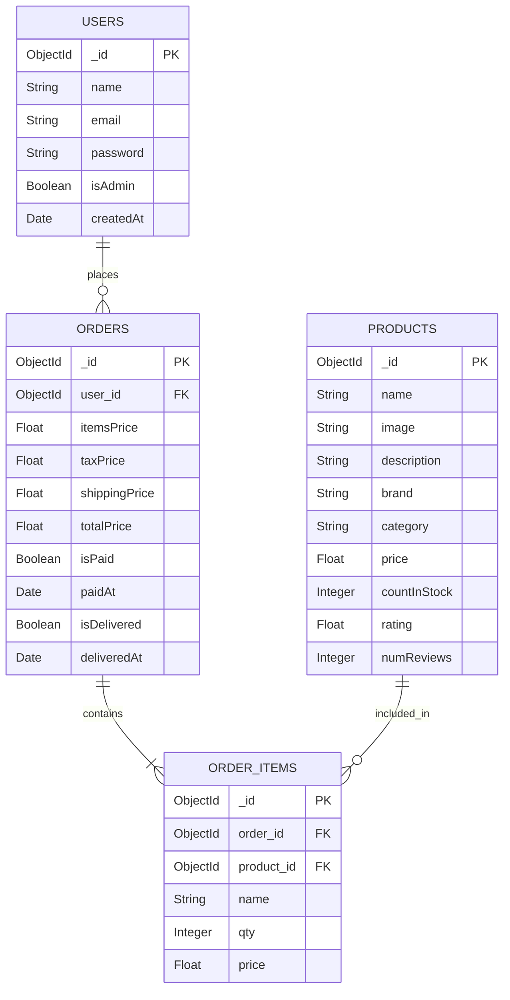

```mermaid
erDiagram
    USERS {
        ObjectId _id PK
        String name
        String email
        String password
        Boolean isAdmin
        Date createdAt
    }

    PRODUCTS {
        ObjectId _id PK
        String name
        String image
        String description
        String brand
        String category
        Float price
        Integer countInStock
        Float rating
        Integer numReviews
    }

    ORDERS {
        ObjectId _id PK
        ObjectId user_id FK
        Float itemsPrice
        Float taxPrice
        Float shippingPrice
        Float totalPrice
        Boolean isPaid
        Date paidAt
        Boolean isDelivered
        Date deliveredAt
    }

    ORDER_ITEMS {
        ObjectId _id PK
        ObjectId order_id FK
        ObjectId product_id FK
        String name
        Integer qty
        Float price
    }

    USERS ||--o{ ORDERS : "places"
    ORDERS ||--|{ ORDER_ITEMS : "contains"
    PRODUCTS ||--o{ ORDER_ITEMS : "included_in"
```
