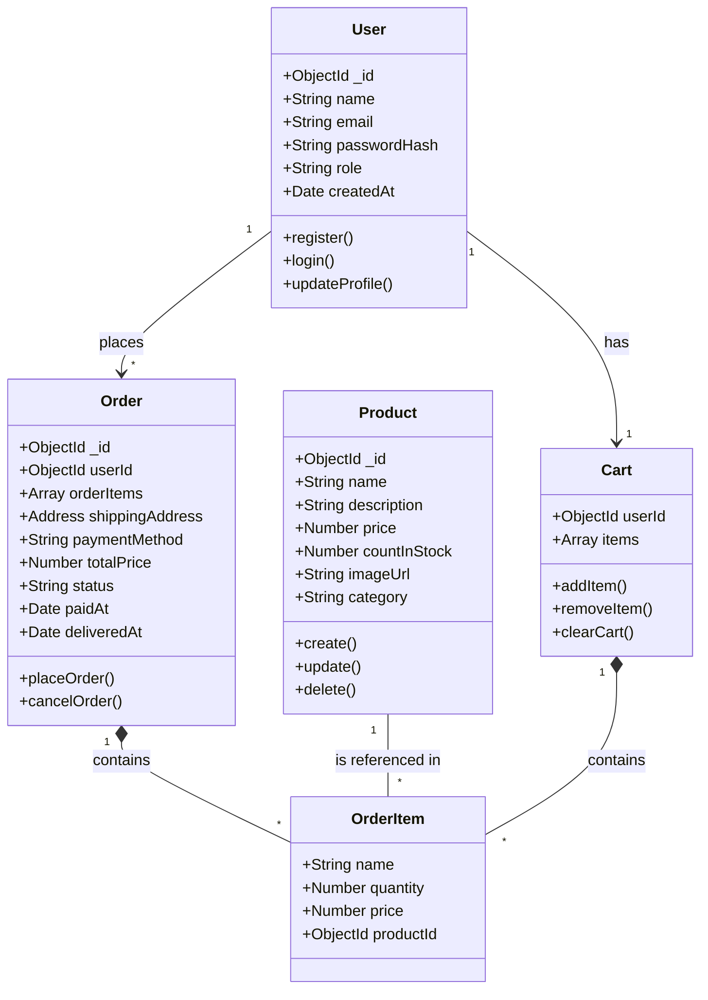

```mermaid
classDiagram
    class User {
        +ObjectId _id
        +String name
        +String email
        +String passwordHash
        +String role
        +Date createdAt
        +register()
        +login()
        +updateProfile()
    }

    class Product {
        +ObjectId _id
        +String name
        +String description
        +Number price
        +Number countInStock
        +String imageUrl
        +String category
        +create()
        +update()
        +delete()
    }

    class Order {
        +ObjectId _id
        +ObjectId userId
        +Array orderItems
        +Address shippingAddress
        +String paymentMethod
        +Number totalPrice
        +String status
        +Date paidAt
        +Date deliveredAt
        +placeOrder()
        +cancelOrder()
    }

    class OrderItem {
        +String name
        +Number quantity
        +Number price
        +ObjectId productId
    }

    class Cart {
        +ObjectId userId
        +Array items
        +addItem()
        +removeItem()
        +clearCart()
    }

    User "1" --> "*" Order : places
    Order "1" *-- "*" OrderItem : contains
    Product "1" -- "*" OrderItem : is referenced in
    User "1" --> "1" Cart : has
    Cart "1" *-- "*" OrderItem : contains
```
