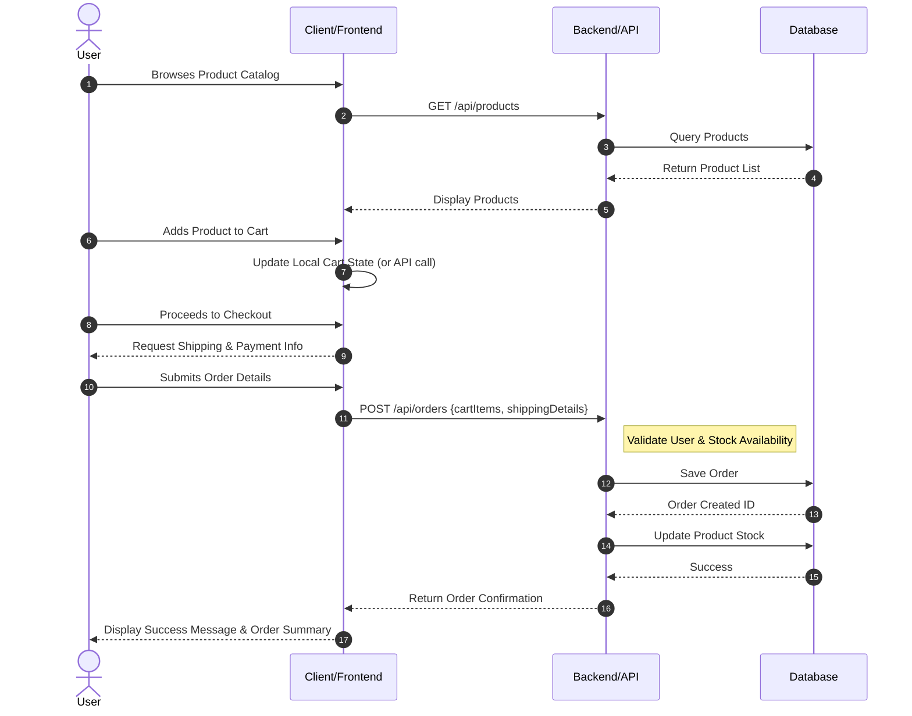

```mermaid
sequenceDiagram
    autonumber
    actor User
    participant Frontend as Client/Frontend
    participant API as Backend/API
    participant DB as Database

    User->>Frontend: Browses Product Catalog
    Frontend->>API: GET /api/products
    API->>DB: Query Products
    DB-->>API: Return Product List
    API-->>Frontend: Display Products

    User->>Frontend: Adds Product to Cart
    Frontend->>Frontend: Update Local Cart State (or API call)
    
    User->>Frontend: Proceeds to Checkout
    Frontend-->>User: Request Shipping & Payment Info
    
    User->>Frontend: Submits Order Details
    Frontend->>API: POST /api/orders {cartItems, shippingDetails}
    
    Note right of API: Validate User & Stock Availability
    
    API->>DB: Save Order
    DB-->>API: Order Created ID
    
    API->>DB: Update Product Stock
    DB-->>API: Success
    
    API-->>Frontend: Return Order Confirmation
    Frontend-->>User: Display Success Message & Order Summary
```
